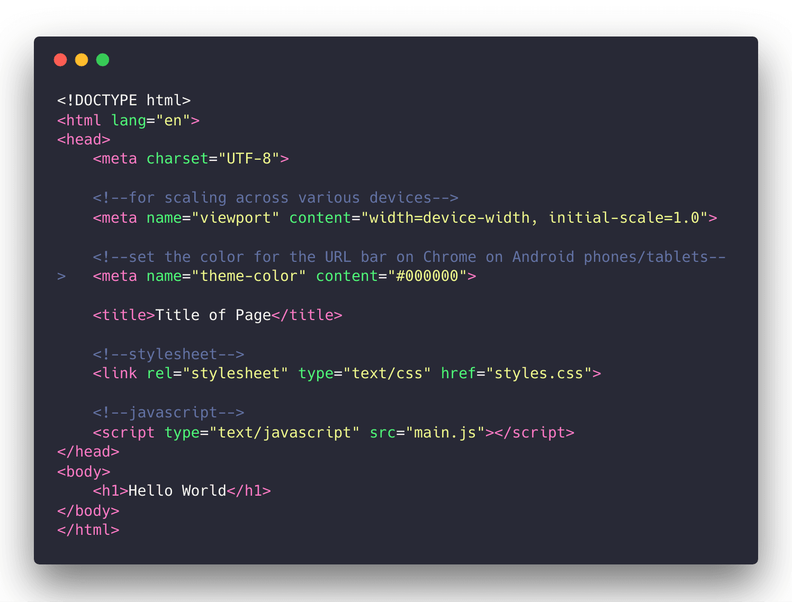

# create-index-html


Create an index.html file with the gist of what you need to get started



## Installation

### From npmjs.org
1. Install Node.js
2. `npm install -g create-index-html`

### Building from Source 
Install Node.js then run the following commands:

```bash
git clone https://github.com/konaraddio/create-index-html.git 
cd create-index-html/
npm install -g
```

Note that in order to update the package, you'll need to build from source again.

## Usage
```
$ create-index-html
```
Creates an index.html in your current working directory. 
```
$ create-index-html <filename>
```
Creates a file of the given name in your current working directory. 
```
$ create-index-html --title='Title of Page'
```
The index.html or given file contains the following:
```html
<!DOCTYPE html>
<html lang="en">
<head>
    <meta charset="UTF-8">

    <!--for scaling across various devices-->
    <meta name="viewport" content="width=device-width, initial-scale=1.0"> 

    <!--set the color for the URL bar on Chrome on Android phones/tablets-->
    <meta name="theme-color" content="#000000">

    <title>Title of Page</title> 

    <!--stylesheet--> 
    <link rel="stylesheet" type="text/css" href="styles.css">

    <!--javascript-->
    <script type="text/javascript" src="main.js"></script>
</head>
<body>
    <h1>Hello World</h1>
</body>
</html>
```
To print the details of usage: 
```
$ create-index-html -h
$ create-index-html --help
```